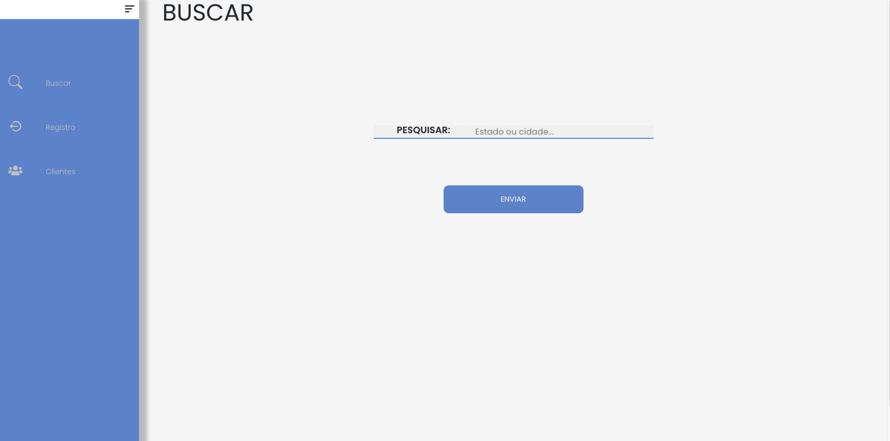
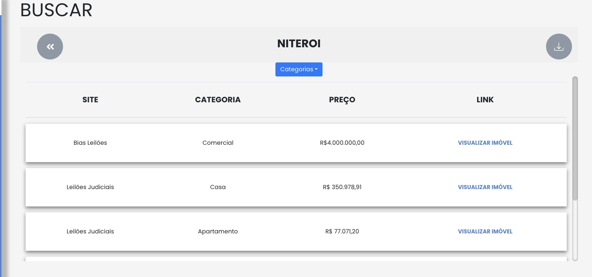

# Auction Data Extraction Project

Welcome to the Auction Data Extraction project! This project aims to extract information about auctions from various websites and provide a user-friendly portal to access and download the gathered data.

## Introduction

In this project, I have developed specialized web crawlers that visit different auction websites and collect relevant information. The crawlers are designed to extract details such as auction dates, item descriptions, starting bids, and other important data.

## Purpose

The purpose of this project is to simplify the process of gathering auction data from multiple sources. Instead of manually visiting each website and manually recording the information, our automated crawlers do the work for you. This significantly saves time and effort, allowing users to focus on analyzing and utilizing the collected data.

## Features

- Automated web crawlers: My custom-built crawlers visit various auction websites and extract data.
- Data collection: The crawlers gather information such as auction dates, item descriptions, starting bids, and more.
- User-friendly portal: We provide a user-friendly web portal where you can access and explore the collected auction data.
- Data download: You have the option to download the collected data in a CSV format for further analysis or integration with other tools.

The sites where the bots are getting the data are:

- am leiloeiro
- bias leiloes
- freitas leiloeiro
- joaoluiz leiloes
- kleiloes
- kronbergleiloes
- lancenoleilao
- leilao brasil
- leilao vip
- leiloes judiciais
- leje
- lut
- mega leiloes
- milan leiloes
- nakakogue leiloes
- nosso leilao
- psn leiloes
- rocha leiloes
- santa catarina leiloes
- sato leiloes
- sodre santoro
- topo leiloes
- zukerman
- franco leiloes
- canal judicial
- central sul
- superbid
- resale
- caixa

Link to the site: [https://leiloes.netlify.app/](https://leiloes.netlify.app/):

## License

This project is licensed under the [MIT License](LICENSE). You are free to use, modify, and distribute the code as per the terms of the license.

## Contact

If you have any questions or need further information about the Auction Data Extraction project, please reach out to us at [email@example.com]. We would be happy to assist you.
